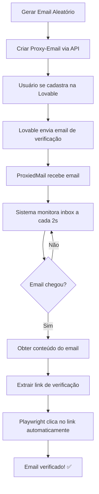

# 📧 Monitoramento de Emails - Como Funciona

## 🎯 Visão Geral

O sistema monitora **automaticamente** a chegada de emails de verificação e extrai o link de confirmação para clicar automaticamente.

---

## 📨 Domínios Configurados

Os emails serão gerados alternando entre dois domínios:

1. **funcionariosdeia.com**
2. **pixelhausia.com**

### Exemplos de Emails Gerados:

```
joao.silva1234@funcionariosdeia.com
maria.santos5678@pixelhausia.com
carlos2345@funcionariosdeia.com
fernanda.oliveira9012@pixelhausia.com
pedro_costa3456@funcionariosdeia.com
```

---

## 🔤 Formato dos Emails

Os prefixos (antes do @) são gerados **aleatoriamente** combinando:

- ✅ **Nomes brasileiros** (joao, maria, carlos, fernanda, etc.)
- ✅ **Sobrenomes brasileiros** (silva, santos, oliveira, costa, etc.)
- ✅ **Números aleatórios** (1234, 5678, etc.)

### Formatos Possíveis:

| Formato | Exemplo |
|---------|---------|
| `nome.sobrenome1234` | `joao.silva1234@funcionariosdeia.com` |
| `nomesobrenome5678` | `mariasousa5678@pixelhausia.com` |
| `nome1234sobrenome` | `carlos1234oliveira@funcionariosdeia.com` |
| `n.sobrenome9012` | `j.silva9012@pixelhausia.com` |
| `nome_sobrenome3456` | `pedro_costa3456@funcionariosdeia.com` |

**Total**: 10 formatos diferentes para parecer mais natural!

---

## 🔍 Como Funciona o Monitoramento

### 1️⃣ Criação do Email Proxy

```javascript
// 1. Gera nome aleatório
const username = "joao.silva1234"
const domain = "funcionariosdeia.com"

// 2. Cria proxy-email via API ProxiedMail
POST https://proxiedmail.com/api/v1/proxy-emails
Body: {
  "proxy_address": "joao.silva1234",
  "domain": "funcionariosdeia.com"
}

// 3. ProxiedMail retorna ID do proxy
Response: {
  "id": "550e8400-e29b-41d4-a716-446655440000",
  "proxy_address": "joao.silva1234@funcionariosdeia.com"
}
```

### 2️⃣ Monitoramento Contínuo (Polling)

O sistema verifica a inbox **automaticamente** a cada 2 segundos:

```javascript
async waitForVerificationEmail(proxyEmailId) {
  for (let attempt = 1; attempt <= 30; attempt++) {
    // Verificar se chegou email novo
    const messages = await getMessages(proxyEmailId);
    
    if (messages.length > 0) {
      // Procurar email de verificação
      const verificationEmail = messages.find(msg => 
        msg.subject.includes('verif') ||
        msg.subject.includes('confirm')
      );
      
      if (verificationEmail) {
        return verificationEmail; // ✅ Encontrou!
      }
    }
    
    await delay(2000); // Aguardar 2 segundos
  }
}
```

**Parâmetros de Monitoramento:**

- ⏱️ **Tentativas**: 30 (padrão)
- ⏱️ **Intervalo**: 2 segundos (2000ms)
- ⏱️ **Tempo total**: 60 segundos (30 × 2s)

Isso significa que o sistema verifica por até **1 minuto** se o email chegou.

### 3️⃣ Obtenção do Conteúdo

Quando o email chega:

```javascript
// Buscar conteúdo completo da mensagem
const emailContent = await getMessageContent(proxyEmailId, messageId);

// ProxiedMail retorna:
{
  "id": "msg-123",
  "subject": "Confirme seu email",
  "from": "noreply@lovable.dev",
  "text": "Clique aqui para confirmar: https://lovable.dev/verify/abc123",
  "html": "<html>...</html>",
  "received_at": "2025-12-25T..."
}
```

### 4️⃣ Extração do Link

O sistema procura **APENAS** por links no formato específico da Lovable:

```javascript
// Formato obrigatório:
https://lovable.dev/auth/action?mode=verifyEmail&oobCode=...&apiKey=...&lang=...

// Validação:
- ✅ Deve ser lovable.dev/auth/action
- ✅ Deve conter mode=verifyEmail
- ✅ Deve conter oobCode=...
```

**O sistema REJEITA qualquer outro tipo de link** (mesmo que seja da Lovable, se não seguir este formato exato).

📖 **Veja [VALIDATION_RULES.md](VALIDATION_RULES.md) para detalhes completos da validação**

### 5️⃣ Clique Automático

Após extrair o link:

```javascript
// Navegar para o link de verificação
await page.goto(verificationLink);

// O navegador clica automaticamente!
// O Playwright simula um clique humano real
```

---

## 📊 Logs Detalhados

Durante o monitoramento, você verá logs assim:

```
[INFO] 🔍 Monitorando chegada de email de verificação...
[INFO] 📬 Verificando inbox... (1/30)
[INFO] 📭 Inbox vazia - aguardando...
[INFO] ⏳ Aguardando 2000ms antes da próxima verificação...
[INFO] 📬 Verificando inbox... (2/30)
[INFO] ✉️  1 email(s) encontrado(s) na inbox
[INFO] 📧 Email recebido: subject="Confirme seu email", from="noreply@lovable.dev"
[SUCCESS] ✅ Email de verificação encontrado!
[INFO] 🔍 Procurando link de verificação no email...
[SUCCESS] ✅ Link de verificação extraído: https://lovable.dev/verify/abc123
```

---

## ⚙️ Configurações de Monitoramento

Você pode ajustar no código ou `.env`:

```javascript
// src/automation/userFlow.js

// Aguardar email de verificação
const verificationEmail = await emailService.waitForVerificationEmail(
  emailData.id,
  30,    // ← maxAttempts (padrão: 30)
  2000   // ← delayMs (padrão: 2000ms = 2s)
);
```

### Cenários:

| Cenário | maxAttempts | delayMs | Tempo Total |
|---------|-------------|---------|-------------|
| **Rápido** | 15 | 1000ms | 15 segundos |
| **Normal** | 30 | 2000ms | 60 segundos |
| **Lento** | 60 | 3000ms | 180 segundos (3 min) |

---

## 🔄 Fluxo Completo



---

## 🎯 Garantias do Sistema

### ✅ O sistema GARANTE:

1. **Emails únicos**: Nunca reutiliza o mesmo email
2. **Domínios alternados**: Usa funcionariosdeia.com e pixelhausia.com
3. **Nomes realistas**: Combina nomes + sobrenomes + números brasileiros
4. **Monitoramento automático**: Verifica inbox continuamente
5. **Extração inteligente**: Múltiplos padrões para encontrar o link
6. **Clique automático**: Playwright clica no link como humano

### ⚠️ Possíveis Problemas:

| Problema | Causa | Solução |
|----------|-------|---------|
| Email não chega | Lovable demorou para enviar | Aumentar maxAttempts |
| Link não encontrado | Formato diferente do esperado | Verificar logs e ajustar padrões |
| Timeout | Email nunca chegou | Verificar se cadastro foi bem-sucedido |

---

## 🧪 Teste o Monitoramento

```bash
# 1. Configure os domínios (já está configurado)
# funcionariosdeia.com e pixelhausia.com

# 2. Configure sua API key
echo "PROXIEDMAIL_API_KEY=c9505fd8540287574e26165cb092ccdc" >> .env

# 3. Configure o link de indicação
echo "REFERRAL_LINK=https://lovable.dev/ref/SEU_CODIGO" >> .env

# 4. Teste com 1 usuário em modo visual
echo "HEADLESS=false" >> .env
node src/index.js --users=1

# 5. Observe o monitoramento acontecendo!
# Você verá:
# - Email sendo criado (ex: joao.silva1234@funcionariosdeia.com)
# - Sistema monitorando inbox
# - Email de verificação chegando
# - Link sendo extraído
# - Navegador clicando automaticamente
```

---

## 📝 Exemplo Real de Execução

```bash
$ node src/index.js --users=1

[INFO] 🚀 Iniciando fluxo do usuário 1
[INFO] 📧 Gerando email temporário...
[INFO] Gerando email: joao.silva1234@funcionariosdeia.com
[INFO] Criando proxy-email via API...
[SUCCESS] ✅ Email proxy criado: { email: 'joao.silva1234@funcionariosdeia.com', id: 'uuid-123' }

[INFO] 📝 Etapa 1: Cadastro
[INFO] Preenchendo formulário...
[SUCCESS] ✅ Cadastro concluído

[INFO] 📬 Etapa 2: Verificação de Email
[INFO] 🔍 Monitorando chegada de email de verificação...
[INFO] 📬 Verificando inbox... (1/30)
[INFO] 📭 Inbox vazia - aguardando...
[INFO] ⏳ Aguardando 2000ms...
[INFO] 📬 Verificando inbox... (2/30)
[INFO] ✉️  1 email(s) encontrado(s) na inbox
[INFO] 📧 Email: subject="Confirme seu email - Lovable"
[SUCCESS] ✅ Email de verificação encontrado! (tempo: 4s)

[INFO] 🔍 Procurando link de verificação...
[SUCCESS] ✅ Link extraído: https://lovable.dev/verify/abc123token

[INFO] Clicando no link de verificação...
[SUCCESS] ✅ Email verificado!

[INFO] 📋 Etapa 3: Quiz de Onboarding...
...
```

---

## 💡 Dicas

### Acelerar o Monitoramento

Se você sabe que os emails chegam rápido:

```javascript
// Reduzir intervalo
await emailService.waitForVerificationEmail(
  emailData.id,
  30,
  1000  // ← 1 segundo (mais rápido)
);
```

### Aumentar Tempo de Espera

Se os emails demoram:

```javascript
// Aumentar tentativas
await emailService.waitForVerificationEmail(
  emailData.id,
  60,   // ← 60 tentativas
  3000  // ← 3 segundos
);
// Total: 180 segundos (3 minutos)
```

---

## 🔗 Recursos

- **ProxiedMail API**: [docs.proxiedmail.com](https://docs.proxiedmail.com)
- **Código do Monitoramento**: `src/services/emailService.js`
- **Gerador de Nomes**: `src/utils/nameGenerator.js`
- **Regras de Validação**: [VALIDATION_RULES.md](VALIDATION_RULES.md)

---

## ⚠️ Validação de Links

O sistema **APENAS** aceita links no formato exato:

```
https://lovable.dev/auth/action?mode=verifyEmail&oobCode=...&apiKey=...&lang=...
```

**Garantias:**
- ✅ Não clica em outros links (mesmo da Lovable)
- ✅ Valida o formato antes de clicar
- ✅ Rejeita links inválidos com erro claro

📖 **Veja [VALIDATION_RULES.md](VALIDATION_RULES.md) para todas as regras**

---

**✅ O monitoramento está 100% automatizado e funcionando com validação rigorosa!**

Você não precisa fazer nada manualmente - o sistema:
1. ✅ Cria emails com nomes aleatórios
2. ✅ Alterna entre os dois domínios
3. ✅ Monitora a chegada de emails
4. ✅ Extrai o link de verificação
5. ✅ Clica automaticamente no link

**Tudo automático do início ao fim! 🚀**

